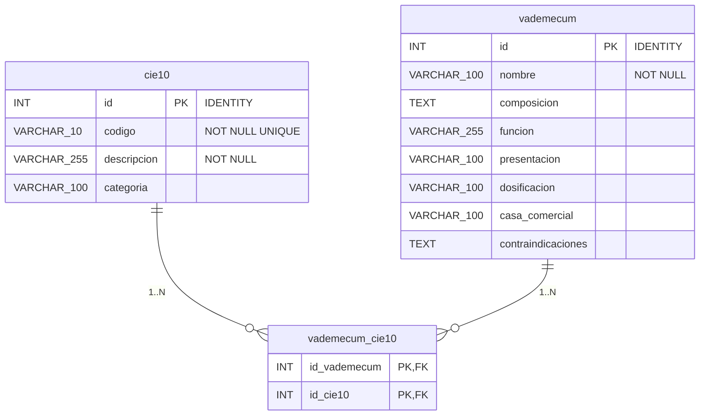

# RecetaRápida API

## Modelo de datos orientado a APIs y contrato OpenAPI

**Universidad Politécnica Salesiana · Ecuador**
**Proyecto Final · Fase 3: Diseño del Modelo y Especificación**

| Campo | Detalle |
|---|---|
| Fase | Fase 3: Diseño del Modelo y Especificación (RA3) |
| Entregable | Modelo de datos orientado a APIs y contrato de la API en OpenAPI 3.0.3 (archivo `openapi.yaml`) |
| Nombre del proyecto | RecetaRápida API |
| Autores | Jhon Meza, Gabriel Vidal, Eduardo Lima, Jumandi Andrade |
| Programa | Ingeniería en Software / Patrones de Diseño de APIs |
| Versión y fecha | 1.0 · 29 de septiembre de 2026 |

---

## 1. Introducción y trazabilidad

Esta fase formaliza las decisiones tomadas en las fases anteriores. A partir de las capacidades de negocio de la Fase 1 (RA1) y de la arquitectura y los patrones de la Fase 2 (RA2), se diseña el modelo de datos orientado a APIs y se escribe el contrato formal de RecetaRápida API con la especificación OpenAPI. El contrato es la fuente de verdad para la integración de los sistemas externos y para el desarrollo de la implementación.

La siguiente matriz muestra cómo cada elemento del contrato se deriva de las fases previas:

| Origen (RA1 / RA2) | Decisión o capacidad | Elemento en el contrato (RA3) |
|---|---|---|
| RA1 · Consulta de CIE-10 | Consultar diagnósticos por código, descripción y categoría | `GET /cie10` · `GET /cie10/{codigo}` |
| RA1 · Consulta de medicamentos | Consultar la ficha del vademécum | `GET /vademecum` · `GET /vademecum/{id}` |
| RA1 · Relación CIE-10–Medicamento | Relaciones solo de consulta | `GET /cie10/{codigo}/vademecum` · `GET /vademecum/{id}/cie10` |
| RA1 · Generación de receta en PDF | Receta con datos de la solicitud, sin almacenarlos | `POST /recetas` (`application/pdf`); recurso transitorio `RecetaRequest` |
| RA2 · Estilo REST | Recursos, verbos y códigos HTTP estándar | Rutas con sustantivos, GET/POST, códigos por operación |
| RA2 · Auth Service con JWT | Identificar consumidores | `POST /auth/register` · `POST /auth/login` · esquema `bearerAuth` |
| RA2 · Paginación y filtrado | Parámetros definidos en RA3 | `page`, `size`, `sort`, `q`, `categoria`, `casaComercial`; esquemas `Pagina*` |
| RA2 · Versionado | Estructura `/api/v1/...` | Base de servidor `/api/v1` y política de versionado (sección 7) |

---

## 2. Principios de diseño del contrato

- **Recursos como sustantivos:** `/cie10`, `/vademecum`, `/recetas`; la acción está en el verbo HTTP.
- **Idioma y convención de nombres:** rutas, parámetros y campos en español. La API usa camelCase (`casaComercial`, `codigosCie10`, `vademecumId`); el snake_case (`casa_comercial`, `id_vademecum`) se reserva para las columnas de la base de datos PostgreSQL.
- **JSON** como formato de intercambio y `application/pdf` únicamente para la receta.
- **Errores estandarizados** con RFC 9457 (`application/problem+json`) en todas las respuestas 4xx y 5xx.
- **Reutilización:** todo lo repetido (esquemas, parámetros, encabezados, respuestas, ejemplos) vive en `components`.
- **Contrato explícito y restrictivo:** tipos, longitudes, patrones, rangos y campos obligatorios definidos para cada dato.
- **Seguridad por defecto:** todas las operaciones exigen JWT salvo registro e inicio de sesión (`security: []`).

---

## 3. Modelo de datos orientado a APIs

Esta sección presenta los recursos que la API expone y recibe. Se distinguen tres grupos según su naturaleza:

| Grupo | Recursos | Característica |
|---|---|---|
| Persistidos (catálogo) | `cie10`, `vademecum` y la relación `vademecum_cie10` | Información cargada en el sistema. Solo lectura desde la API. |
| Transitorios | `RecetaRequest` (con paciente, profesional y medicamentos anidados) | Se reciben, se usan para generar el PDF y se descartan. No se almacenan (RA1 y RA2). |
| De soporte | `Credenciales`, `UsuarioRegistrado`, `TokenResponse`, `PageMeta` / `Pagina*`, `Problem` | Autenticación, paginación y manejo de errores. |

### 3.1 Recursos persistidos

**Figura 1. Modelo de los recursos de catálogo.**



> Relación N:M (solo lectura). `vademecum_cie10`: PK compuesta y FK con `ON DELETE CASCADE`; no tiene endpoints propios.

Los nombres de las tablas y de las columnas corresponden al esquema SQL definido por el equipo (en snake_case); la API expone los mismos campos en camelCase, y solo `casa_comercial` cambia de forma (`casaComercial`). La relación N:M entre `cie10` y `vademecum` (tabla intermedia `vademecum_cie10`) se expone como sub-recurso (`/cie10/{codigo}/vademecum` y `/vademecum/{id}/cie10`) y no como una entidad independiente, porque solo se consulta desde alguno de sus dos extremos.

#### Tabla `cie10`

| Campo API | Columna SQL | Tipo SQL | Oblig. | Ejemplo / restricción |
|---|---|---|---|---|
| `id` | `id` | INT (PK, IDENTITY) | Sí | Solo respuesta. Ej.: `1` |
| `codigo` | `codigo` | VARCHAR(10) NOT NULL UNIQUE | Sí | Patrón `^[A-Z][0-9]{2}(\.[0-9A-Z]{1,4})?$`. Ej.: `J00` |
| `descripcion` | `descripcion` | VARCHAR(255) NOT NULL | Sí | Ej.: Rinofaringitis aguda [resfriado común] |
| `categoria` | `categoria` | VARCHAR(100) | No | Ej.: Enfermedades del sistema respiratorio |

#### Tabla `vademecum`

| Campo API | Columna SQL | Tipo SQL | Oblig. | Ejemplo / restricción |
|---|---|---|---|---|
| `id` | `id` | INT (PK, IDENTITY) | Sí | Solo respuesta. Ej.: `101` |
| `nombre` | `nombre` | VARCHAR(100) NOT NULL | Sí | Ej.: Paracetamol |
| `composicion` | `composicion` | TEXT | No | Ej.: Paracetamol 500 mg |
| `funcion` | `funcion` | VARCHAR(255) | No | Ej.: Analgésico y antipirético |
| `presentacion` | `presentacion` | VARCHAR(100) | No | Ej.: Caja x 20 tabletas |
| `dosificacion` | `dosificacion` | VARCHAR(100) | No | Ej.: 500 mg cada 6 a 8 horas |
| `casaComercial` | `casa_comercial` | VARCHAR(100) | No | Ej.: Laboratorios Ejemplo S.A. |
| `contraindicaciones` | `contraindicaciones` | TEXT | No | Sin límite definido |

#### Tabla `vademecum_cie10` (relación)

| Campo | Tipo SQL | Restricciones |
|---|---|---|
| `id_vademecum` | INT | Parte de la PK compuesta. FK a `vademecum(id)`, `ON DELETE CASCADE` |
| `id_cie10` | INT | Parte de la PK compuesta. FK a `cie10(id)`, `ON DELETE CASCADE` |

Los tipos corresponden a PostgreSQL, donde la clave `id` se genera automáticamente (identity). Los campos que la API devuelve para cada registro son los mismos de la tabla, en camelCase; en la base de datos los campos sin `NOT NULL` admiten valores nulos y en el contrato se marcan como `nullable`. La tabla `vademecum_cie10` no se devuelve como objeto: solo se usa para resolver las consultas de relación.

### 3.2 Recurso transitorio: receta

**Figura 2. Estructura de `RecetaRequest`.**

```text
RecetaRequest (transitorio)
├── paciente
│   ├── nombre: string
│   └── edad: int (0-130)
├── profesional
│   └── nombre: string
├── fecha: date
├── codigosCie10: string[1..10]
└── medicamentos: objeto[1..10]
    ├── vademecumId: int32
    ├── dosis: string
    ├── frecuencia: string
    ├── duracion: string
    └── indicaciones: string?
```

> Un solo recurso: los datos del paciente, del profesional y de cada medicamento recetado van anidados en la solicitud.

**Cómo se arma la receta:** el consumidor consulta `GET /vademecum`, toma el `id` de cada registro seleccionado y, por cada uno, agrega un elemento a la propiedad `medicamentos` con su `vademecumId` y la dosis, frecuencia, duración e indicaciones. Esos campos pertenecen a `RecetaRequest`: no existe un recurso aparte para el tratamiento. La propiedad `codigosCie10` es un arreglo de códigos simples, mientras que `medicamentos` es un arreglo de objetos. Ambos admiten de 1 a 10 elementos (1..10). Los diagnósticos y los medicamentos son listas independientes: la receta no asocia cada medicamento a un diagnóstico concreto.

| Campo | Tipo | Oblig. | Restricciones |
|---|---|---|---|
| `paciente.nombre` | string | Sí | 2–150 caracteres |
| `paciente.edad` | integer | Sí | 0–130 (años cumplidos) |
| `profesional.nombre` | string | Sí | 2–150 caracteres |
| `fecha` | string (date) | Sí | Formato ISO 8601, AAAA-MM-DD |
| `codigosCie10` | array | Sí | 1 a 10 elementos, sin repetidos (`minItems: 1`, `maxItems: 10`, `uniqueItems`). Cada elemento usa el patrón de `cie10.codigo` y debe existir en el catálogo (si no, 422) |
| `medicamentos` | array | Sí | 1 a 10 elementos (`minItems: 1`, `maxItems: 10`) |
| `medicamentos[].vademecumId` | integer (int32) | Sí | Debe existir en `vademecum.id` (si no, 422) |
| `medicamentos[].dosis` / `frecuencia` / `duracion` | string | Sí | 1–100 caracteres |
| `medicamentos[].indicaciones` | string | No | Máx. 500 |

### 3.3 Recursos de soporte

| Recurso | Campos | Uso |
|---|---|---|
| `Credenciales` | `email` (email, máx. 254), `password` (8–72, writeOnly) | Cuerpo de registro e inicio de sesión |
| `UsuarioRegistrado` | `id`, `email` | Respuesta 201 del registro |
| `TokenResponse` | `accessToken`, `tokenType` (Bearer), `expiresIn` (segundos) | Respuesta del inicio de sesión |
| `PageMeta` | `page` (desde 1), `size` (1–100), `totalElements`, `totalPages` | Metadatos comunes de paginación |
| `PaginaCie10` / `PaginaVademecum` | `PageMeta` + `content[]` | Envoltorio reutilizable (`allOf`) |
| `Problem` | `type`, `title`, `status`, `detail`, `instance`, `errores[]` (opcional) | Error RFC 9457. `errores[]` lista campo y mensaje en fallos de validación |

---

## 4. Catálogo de endpoints

Todas las rutas cuelgan de la base `/api/v1`. El contrato define 9 operaciones, cada una con `operationId` único, resumen, descripción, ejemplos y respuestas de error.

| Tag | Método | Ruta | operationId | Propósito |
|---|---|---|---|---|
| Auth | POST | `/auth/register` | `registrarUsuario` | Registrar un consumidor |
| Auth | POST | `/auth/login` | `iniciarSesion` | Obtener el token JWT |
| CIE-10 | GET | `/cie10` | `listarCie10` | Listar y buscar en `cie10` (paginado) |
| CIE-10 | GET | `/cie10/{codigo}` | `obtenerCie10` | Obtener un registro de `cie10` |
| CIE-10 | GET | `/cie10/{codigo}/vademecum` | `listarVademecumDeCie10` | Vademécum relacionado con un diagnóstico |
| Vademécum | GET | `/vademecum` | `listarVademecum` | Listar y buscar en el vademécum (paginado) |
| Vademécum | GET | `/vademecum/{id}` | `obtenerVademecum` | Obtener la ficha de un registro del vademécum |
| Vademécum | GET | `/vademecum/{id}/cie10` | `listarCie10DeVademecum` | Registros CIE-10 relacionados con un registro del vademécum |
| Recetas | POST | `/recetas` | `generarReceta` | Generar la receta en PDF |

### 4.1 Parámetros de consulta

| Parámetro | Aplica a | Descripción y restricciones |
|---|---|---|
| `q` | `/cie10`, `/vademecum` | Texto libre (2–100). En CIE-10 busca en código y descripción; en el vademécum, en nombre y composición. |
| `categoria` | `/cie10` | Filtro por categoría (2–100). |
| `casaComercial` | `/vademecum` | Filtro por casa comercial (2–100). |
| `page` | Todos los listados | Entero ≥ 1. Por defecto 1. |
| `size` | Todos los listados | Entero de 1 a 100. Por defecto 20. |
| `sort` | Todos los listados | Formato `campo,direccion` con valores enumerados. CIE-10: `codigo`, `descripcion` (por defecto `codigo,asc`). Vademécum: `nombre`, `casaComercial` (por defecto `nombre,asc`). |

### 4.2 Códigos HTTP por endpoint

> Nota: la tabla original del PDF no permite distinguir con precisión la columna de cada "X". Se transcribe la información textual disponible; consulte el PDF o el `openapi.yaml` para la matriz exacta.

| Endpoint | Respuesta de éxito | Errores documentados |
|---|---|---|
| `POST /auth/register` | 201 | 4 respuestas de error documentadas en total (incluye 500) |
| `POST /auth/login` | 200 | 4 respuestas de error documentadas en total (incluye 500) |
| `GET /cie10` | 200 | 4 respuestas de error documentadas en total (incluye 500) |
| `GET /cie10/{codigo}` | 200 | 5 respuestas de error documentadas en total (incluye 404 y 500) |
| `GET /cie10/{codigo}/vademecum` | 200 | 5 respuestas de error documentadas en total (incluye 404 y 500) |
| `GET /vademecum` | 200 | 4 respuestas de error documentadas en total (incluye 500) |
| `GET /vademecum/{id}` | 200 | 5 respuestas de error documentadas en total (incluye 404 y 500) |
| `GET /vademecum/{id}/cie10` | 200 | 5 respuestas de error documentadas en total (incluye 404 y 500) |
| `POST /recetas` | 200 (PDF) | 5 respuestas de error documentadas en total (incluye 422 y 500) |

En el registro, la respuesta de éxito es 201; en los demás casos, 200.

---

## 5. Convenciones transversales

### Paginación, filtrado y ordenamiento

Los listados devuelven un envoltorio con `content`, `page`, `size`, `totalElements` y `totalPages`. El tamaño de página está acotado a 100 registros para proteger el servicio y reducir el volumen transferido, según lo definido en RA2. Los criterios de ordenamiento se limitan a un conjunto enumerado, lo que evita ordenar por campos sin índice.

### Seguridad

El esquema `bearerAuth` (HTTP, esquema bearer, formato JWT) se aplica de forma global. El API Gateway valida el token antes de enrutar. Registro e inicio de sesión sobrescriben la seguridad con `security: []`. Se documentan las respuestas 401 (token ausente o inválido) y 403 (token válido sin permiso).

### Manejo de errores

Todas las respuestas de error usan el esquema `Problem` (RFC 9457) con `application/problem+json`. Se distingue **400** (solicitud mal formada o parámetros fuera de rango) de **422** (cuerpo bien formado pero con referencias inexistentes, por ejemplo un `vademecumId` que no existe) y de **404** (recurso de ruta inexistente).

### Caché HTTP

Como CIE-10 y el vademécum cambian con poca frecuencia, las respuestas de consulta informan `Cache-Control`, aprovechando el argumento de RA2 a favor de REST. La respuesta de `POST /recetas` usa `Cache-Control: no-store` porque el PDF contiene datos personales.

---

## 6. Decisiones de diseño y supuestos

| # | Decisión / supuesto | Justificación |
|---|---|---|
| 1 | `POST /recetas` responde 200 y no 201. | No se crea ni persiste ningún recurso: es una operación de generación. Coherente con RA1/RA2 (no se almacenan datos personales). |
| 2 | No existe `GET /recetas` ni `GET /recetas/{id}`. | Consecuencia directa de no almacenar las recetas. |
| 3 | Catálogos solo con GET (sin PUT, PATCH ni DELETE). | RA1 indica que la información y las relaciones son únicamente de consulta. La carga y el mantenimiento de datos quedan fuera del contrato. |
| 4 | La receta acepta un arreglo de medicamentos (de 1 a 10). | RA1 habla de "medicamento" en singular y de "medicamentos seleccionados" en otros apartados. El arreglo cubre ambos casos. El máximo de 10 es una medida técnica de protección: evita solicitudes desmedidas al generar el PDF. |
| 5 | La receta admite uno o varios diagnósticos (`codigosCie10`, de 1 a 10, sin repetidos). | Un paciente puede tener más de un diagnóstico en la misma consulta. RA1 habla de "el diagnóstico" en singular; el arreglo lo generaliza sin perder el caso de un solo diagnóstico. Los medicamentos no se asocian a un diagnóstico específico: son dos listas independientes. |
| 6 | `q` es texto libre sobre código y descripción (CIE-10) y sobre nombre y composición (vademécum). | Simplicidad, consistente con el principio de RA1. Puede ampliarse sin romper compatibilidad. |
| 7 | Relaciones paginadas. | Un registro de `cie10` o de `vademecum` puede tener muchas relaciones; se reutiliza el mismo envoltorio de paginación. |
| 8 | El registro devuelve solo `id` y `email`. | Nunca se devuelve la contraseña (campo `password` writeOnly). |
| 9 | Las páginas se numeran desde 1. | Es más legible para quien consume la API: la primera página es la página 1. La implementación traduce este número al índice interno del framework. |
| 10 | Rutas y campos en español. | Consistencia con el dominio (CIE-10 y vademécum) y con el idioma del proyecto. |
| 11 | Convención de nombres: snake_case solo en la base de datos (PostgreSQL) y camelCase en la API. | Es la práctica habitual en cada capa. Las tablas (`cie10`, `vademecum`, `vademecum_cie10`) conservan los nombres del esquema SQL; el único campo que cambia de forma es `casa_comercial` (SQL) / `casaComercial` (API). |
| 12 | `cie10` incluye el campo `id` además de `codigo`; las rutas identifican el diagnóstico por `codigo`. | El esquema define `id` como PK y `codigo` como UNIQUE. El código es la clave natural que usa un profesional, y el `id` se devuelve en la respuesta. |

---

## 7. Política de versionado

La versión mayor forma parte de la ruta (`/api/v1`) y la versión del contrato sigue el esquema `MAJOR.MINOR.PATCH` en `info.version`.

| Tipo de cambio | Ejemplos | Impacto |
|---|---|---|
| Incompatible (breaking) | Eliminar o renombrar un campo, ruta o parámetro; volver obligatorio un campo opcional; cambiar un tipo; restringir valores permitidos. | Nueva versión mayor (`/api/v2`). |
| Compatible | Agregar un endpoint, un campo opcional en una respuesta, un parámetro de consulta opcional o un valor a un enum de respuesta. | Versión menor (`1.1.0`). |
| Correcciones | Mejorar descripciones, ejemplos o documentación sin afectar el comportamiento. | Versión de parche (`1.0.1`). |
